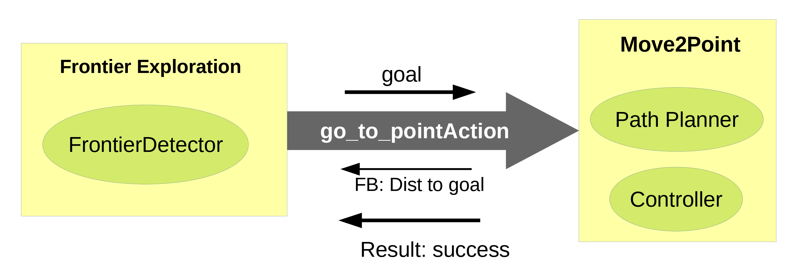
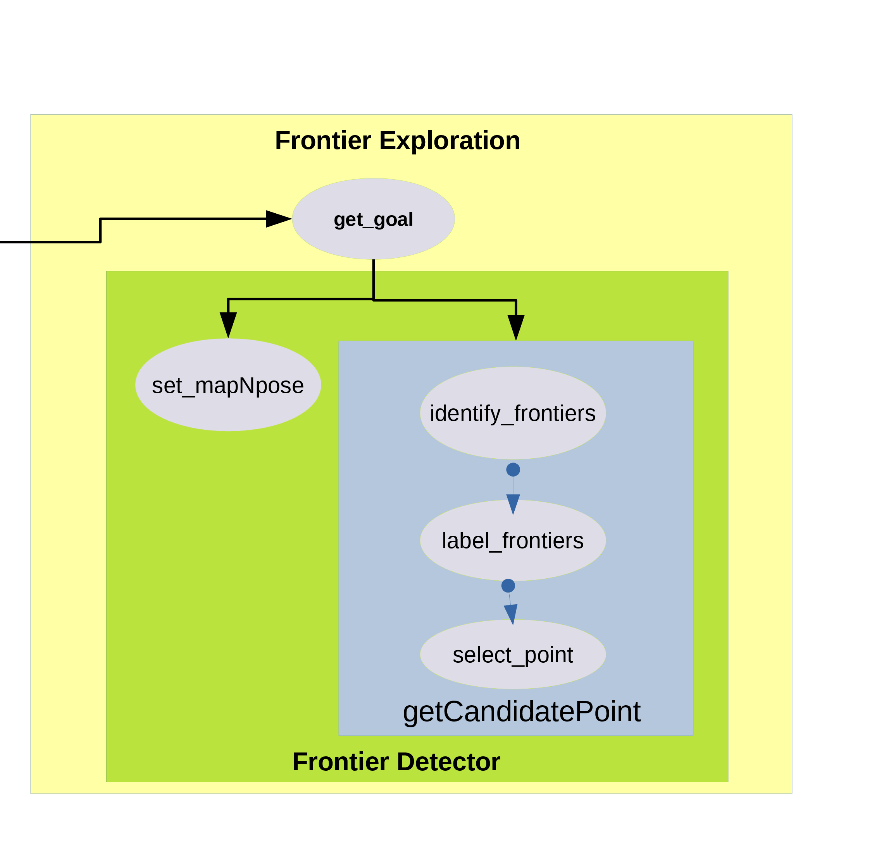
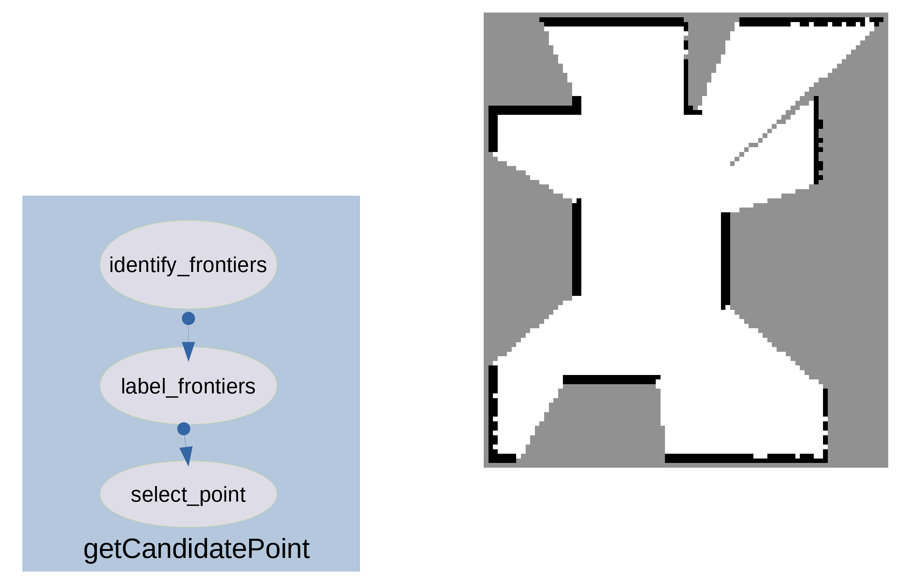
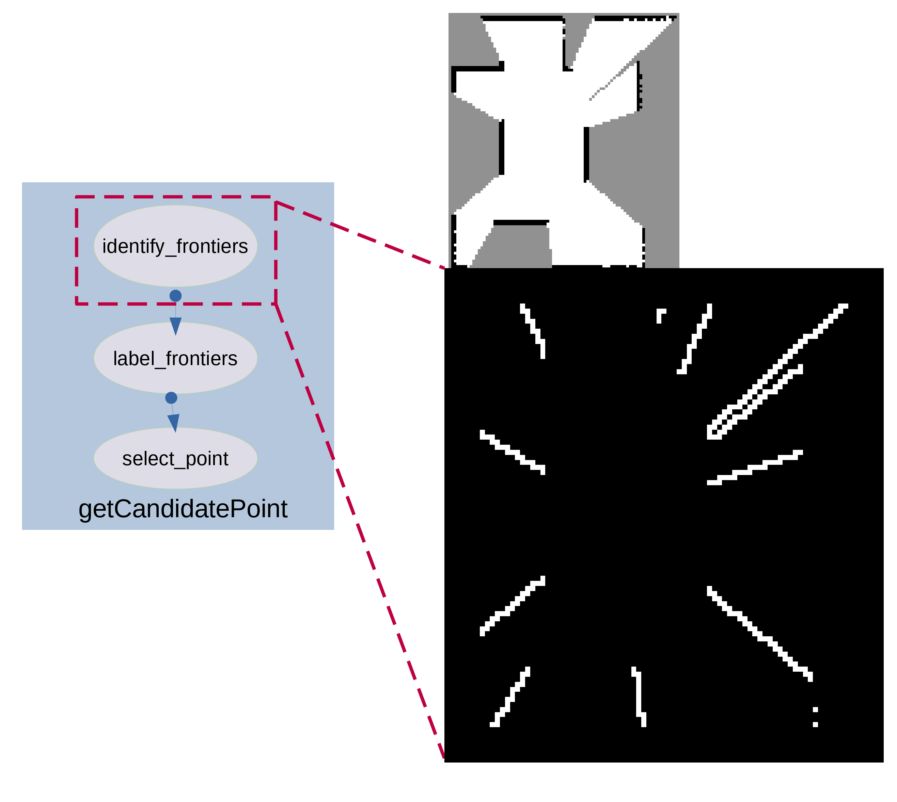
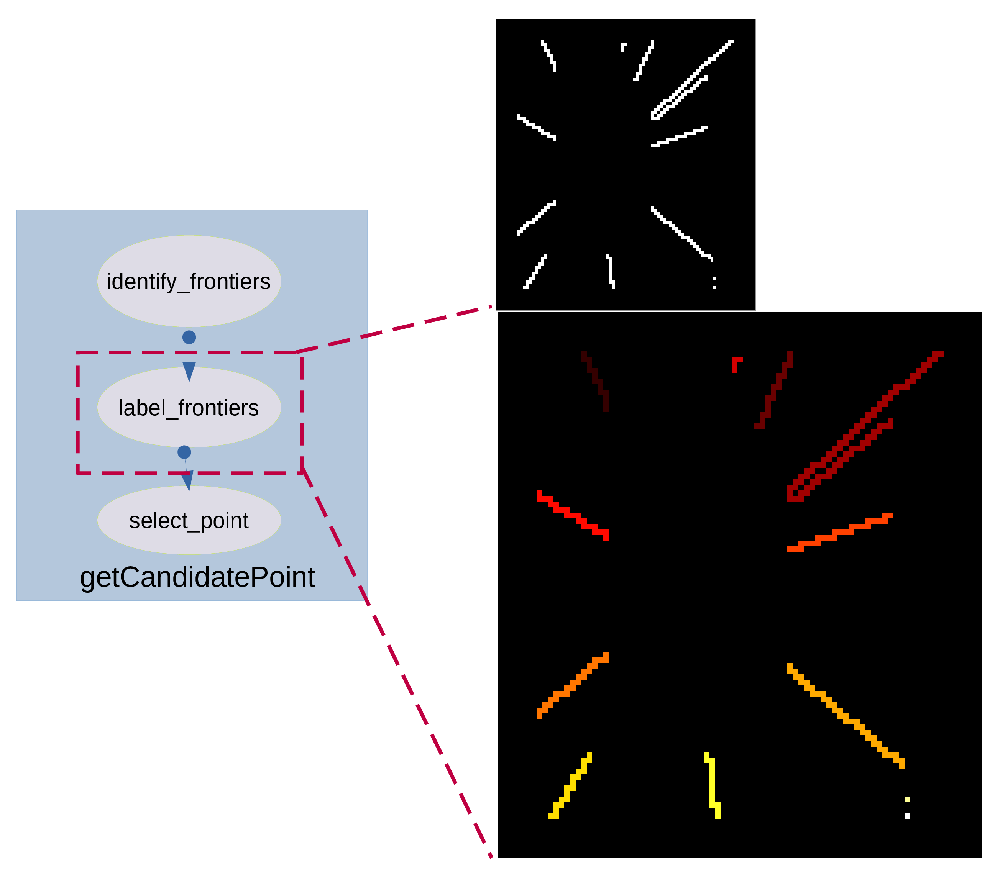
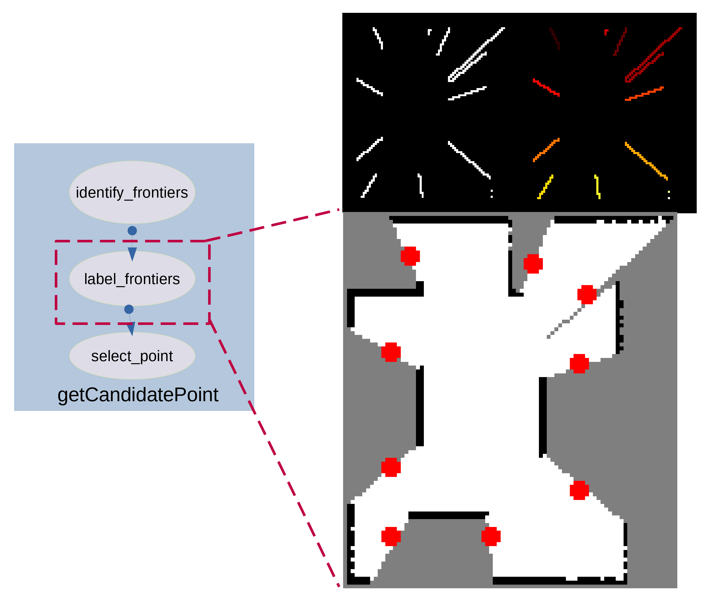
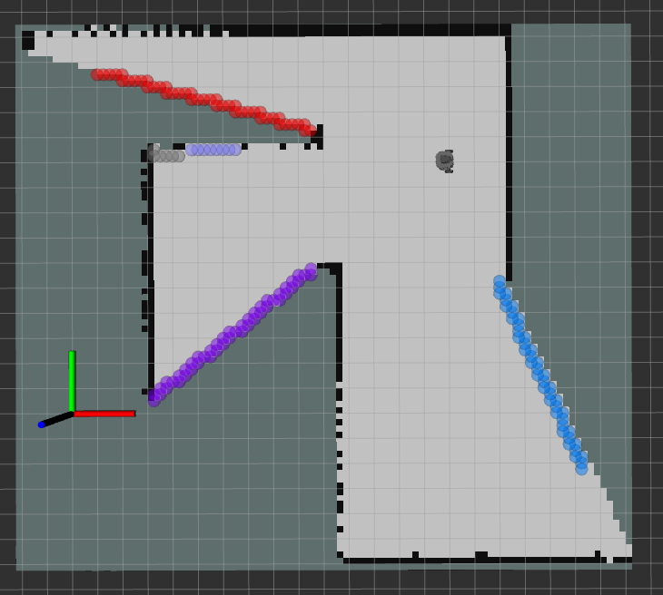
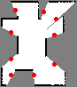

# Frontier Exploration - Hands-on Planning
## dependencies:
- pip install scikit-image

## HOW TO RUN:

1. Clone in your WS
2. export TURTLEBOT3_MODEL=burger
3. in same terminal: roslaunch frontier_explorationb octomap.launch
- octomap2,3 so on .launch
4. new terminal: rosrun frontier_explorationb frontier_exploration.py
5. new terminal: rosrun frontier_explorationb move_to_pt.py

# Explanation

# Nodes

There are two main nodes: frontier_exploration and move_to_pt. The comunicated between the two is based on ROS-Actions. Actions are similar to services, but more relavant in case where a node asks the other node to move the robot, and expects some intermediate feedback and a final result when the task is done. In our case, the get_goal() function is called in the init, which continuously iterates sending an action when required and getting feedback and results. I dont know how the while loop in get_goal() is working, but its working so just forget it for now. I will investigate and clean it later.

## frontier_exploration

This node is responsible for processing the occupancy image and getting frontiers. In essence it uses the FrontierDetector class in the frontier_classes.py file in the utils_lib folder. The get_goal() function first calls the setmapNpose() method of the FrontierDetector class, which updates the two respective attributes of the class. Then the get_candidate_point() method of the class is called. This is the main function responsible for using the occupancy map and the pose and returns the candidate points in occupancy map coordinates in a order manner according to the IG criterion specified.

This function achieves its purpose by calling 3 other methods.
The input is an occupancy map as show.

the idenitify_frontiers() method uses this map and does selective edge detection. End output is a binary image with background cells of value 0 and frontier cells with a value of 255. The 255 value is chosen to make image processing in the next function easier

This binary image is used by the label_image() method. It is responsible for labelling or clustered the frontier cells based on connectivity. This is achieved by the scimage package.

The same package is also used to extract the centroids of each of the clustered frontiers. These serve as the candidate (possible goal) points.

The select_point() method is responsible for creating a sorted list of points according to the IG criterion described. Different functions are created for different IG criterion. These include:
1. nearest_frontier
2. farthest_frontier
3. maximum_area
4. maximum_information_gain
5. biggest_cluster
6. dist_weighted_information_gain

Finally after all this, the get_candidate_point() method of the FrontierDetector class returns the ordered list of candidate points to the get_goal function of frontier_exploration node. Then the first point is selected and sent as goal to the move_to_point node.

All other functions in this node are either visualizations or helper functions.

## move_to_pt

The move_to_pt node acts as a action server, which receives the goal point, and responsible for motion planning and control of the robot. The main 2 deisgn choices are motion planner and controller. Currently there are 9 motion planner choices. RRTStarOMPL, InRRTStar-, FMT-, BIT-, InRRTStar-Dubins, FMT-Dubins, BIT-Dubins, InRRTStar-BSpline. FMT-BSpline, BIT-BSpline

The motion planners that include Dubins or Spline need a curved controller. A sample of setting the two variables in the init of the node is shown below:

**self.planner_config = 'BIT-'**

**self.curved_coltroller = False**

## Visualizations

## Results as images

**Occupancy Grid**

**Frontier Extraction**

**Clustering**

**Candidate Points Selection**

